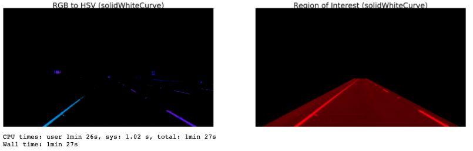

# Self-Driving Car Engineer Nanodegree

## Project: **Finding Lane Lines on the Road** 

#### 1. The Pipeline

My pipeline is consisted of 6 steps as follows: 

1. Converting RGB frames into HSV
2. Smoothing the frames to suppress noise
3. Canny transformation to detect lanes
4. Applying polygon mask to get rid of the noise
5. Hough transformation to detect line segments
6. Separating line segments and fitting a single line

In this project, i started to converting the RGB images into grayscale, however, the result for the video 'challenge.mp4' was not satisfactory.  
After a research on medium.com and github (references: [1],[2],[3]), I found a better way which is converting RGB image to HSV (Hue, Saturation, Value) space instead of only converting grayscale space. Converting the image to HSV color space made it easy for me **to make the lanes distinctive**. It also provide me a more general solution to overcome overfitting problem in which I mention about it below.

To get a better results I changed the Canny and Hough space parameters with a heuristic approach.
I also changed the shape of my polygon mask in order to capture region of interest better.
However, since I optimize my mask by using sample videos, this makes my optimization **non-generalizable** and this is a serious problem.  
To overcome this problem i used 'cv2.inRange()' method from opencv library. First of all, I approximately found the RGB values of the lane colors in the sample videos using the tool at **https://imagecolorpicker.com/**. Then, I limit these values in the dark and light range and try to eliminate places other than these colors.  

To get 2 continuous lines, Hough transformation is used. First, it was found that each line belongs to the right or left lane according to the X value of the end points. Then slopes for the lines were calculated. Since the slope for the real lane lines can vary, a reasonable range for the slope was determined. The X and Y values were combined in a list for the corresponding lines whose slope stay in the range. (The lines whose slope do not stay in the range, were  eliminated). Then, a polynomial whose degree is 1, was fitted for each line.

Results were pushed in a buffer whose size is given in the parameters. If buffer size is exceeded, the oldest one is dropped so that the newest line can be pushed onto the buffer.

The heuristic approach was used to optimize parameters throughout the study.

### 2. Potential shortcomings with the current pipeline

In the event that vehicles change lanes or if a vehicle enters the existing lane, particularly depending on the size and color of the vehicle, the results will be radically affected.

Changing the angle and / or intensity of daylight can affect performance. If this change is radical (for example, at night), the results can also affect radically.

The sharpness of the bend will seriously affect the results.

### 3. Suggestion of possible improvements to the pipeline

Instead of finding lane RGB values with screenshots from sample videos, different masks can be created for different scenarios. Because in real life, there is a much greater variance in lane colors due to the angle of the sun rays, season, shadows and deformation of lanes (brake marks, rain marks, etc.). Relative differences can be considered here rather than the current lane colors from the example (short) videos.

In this study, a polynomial with a grade was fit. Instead of using higher grade polynomials, performance in curved-lanes can be improved.

More successful results are obtained if multiple polygon masks and their usage criteria are defined instead of a single polygon mask usage.

Instead of the heuristic approach, if an optimization is made with a criterion to be determined, a more inclusive parameter set can be obtained or the parameters can be made dynamic.

[1]: https://medium.com/activating-robotic-minds/finding-lane-lines-on-the-road-30cf016a1165
[2]: https://medium.com/computer-car/udacity-self-driving-car-nanodegree-project-1-finding-lane-lines-9cd6a846c58c
[3]: https://github.com/liamondrop/finding-lane-lines/blob/master/WRITEUP.md

