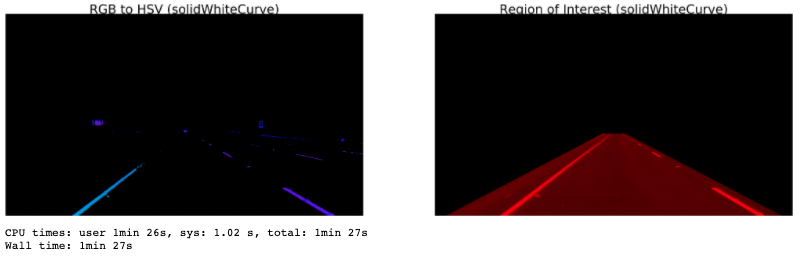

# **Finding Lane Lines on the Road** 

### Reflection

#### 1. The Pipeline

My pipeline is consisted of 6 steps as follows: 

1. Converting RGB frames into HSV
2. Smoothing the frames to suppress noise
3. Canny transformation to detect lanes
4. Applying polygon mask to get rid of the noise
5. Hough transformation to detect line segments
6. Separating line segments and fitting a single line

In this project, i started to converting the RGB images into grayscale, however, the result for the video 'challenge.mp4' was not satisfactory.  
After a research on medium.com and github (references: [1],[2],[3]), I found a better way which is converting RGB image to HSV (Hue, Saturation, Value) space instead of only converting grayscale space. Converting the image to HSV color space made it easy for me **to make the lanes distinctive**. It also provide me a more general solution to overcome overfitting problem in which I mention about it below.

To get a better results I changed the Canny and Hough space parameters with a heuristic approach.
I also changed the shape of my polygon mask in order to capture region of interest better.
However, since I optimize my mask by using sample videos, this makes my optimization **non-generalizable** and this is a serious problem.  
To overcome this problem ı used 'cv2.inRange()' method from opencv library. First of all, I approximately found the RGB values of the lane colors in the sample videos using the tool at **https://imagecolorpicker.com/**. Then, I limit these values in the dark and light range and try to eliminate places other than these colors.  

To get 2 continuous lines, Hough transformation is used. First, it was found that each line belongs to the right or left lane according to the X value of the end points.

### 2. Identify potential shortcomings with your current pipeline

Sharp curves and hills would change the angles of the lines and probably break the lane detector.  

If the car were to change lanes, the results would be chaotic during the lane change.  

### 3. Suggest possible improvements to your pipeline

Instead of finding lane RGB values with screenshots from sample videos, different masks can be created for different scenarios. Because in real life, there is a much greater variance in lane colors due to the angle of the sun rays, season, shadows and deformation of lanes (brake marks, rain marks, etc.).

Rather than fitting a line, fitting a curve with a higher degree polynomial might provide a more accurate set of lane lines for sharp curves. Having more polygon mask shapes (e.g. for sharp right or left turns) might also be necessary if the curves are very sharp.

Defining a procedure to detect a lane change and switch the lane lines to next lane would be needed for a smooth transition.

[1]: https://medium.com/activating-robotic-minds/finding-lane-lines-on-the-road-30cf016a1165
[2]: https://medium.com/computer-car/udacity-self-driving-car-nanodegree-project-1-finding-lane-lines-9cd6a846c58c
[3]: https://github.com/liamondrop/finding-lane-lines/blob/master/WRITEUP.md

